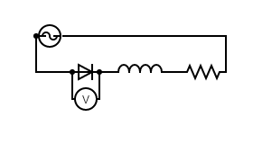
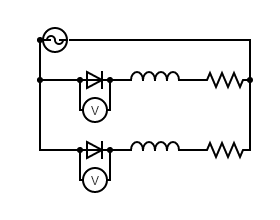
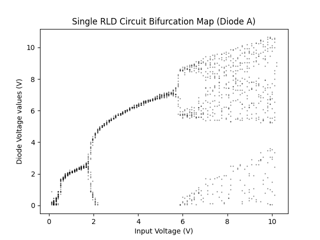
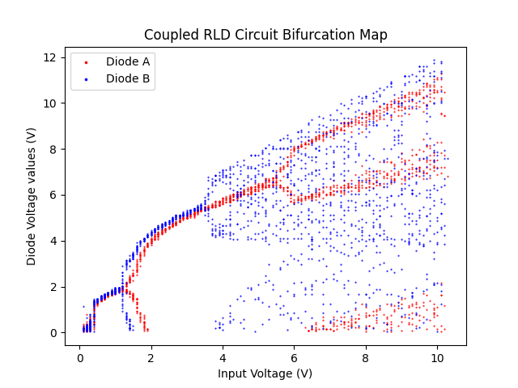
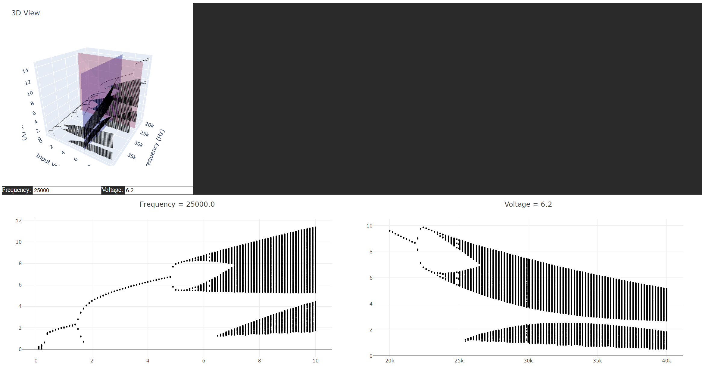

# Set Up

The circuits set up in the expirement are as following:

The AC Source used was a Tektronix AFG3021B.

The voltage measurements were performed using a Tektronix MDOD3024 Oscilloscope.

For the test data presented in this repository, the following circuits were used:

| Circuit | Diode  | R (Ω) | L (mH) |
|---------|--------|-------|--------|
| A       | 1N4007 | 100   | 99     |
| B       | 1n4007 | 100   | 100.2  |

For a detailed analysis of the chaotic behavior of RLD circuits:
[Van Buskirk and Jeffries, 1985 (Phys. Rev. A 31, 3332)](https://journals.aps.org/pra/abstract/10.1103/PhysRevA.31.3332)

# Code Usage

## live_scope.py
Use the `live_scope.py` application to communicate with the AC Source and Oscilloscope and save/draw the experiments results.
For detailed option descriptions, run:
`python live_scope.py --help`

## chaos.py
A collection of methods to analyze raw data from the Oscilloscope.
The module is well documented and examples are provided in `example.py`. The results from the test data should come out as:

## results_viewer.jl
An interactive Julia utility (written using Plotly and Dash) to view 3D bifurcation maps (the results of voltage and frequency sweeps).
Usage is currently very primitive - edit the beginning of the file to include the JSON files of your runs in the `file` variable, and set the resolution of the 3D plot (at higher grained resolutions, large data sets will incure performance hits).

Run the app using `julia results_viewer.jl` and finally access it via `localhost:10321` in your favorite browser:

You can edit the Frequency and Voltage text boxes to change the focused slices on the Input Frequency and Input Voltage axes respectively.
